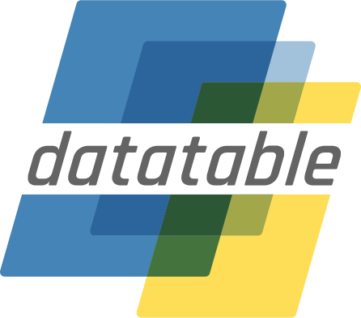

|logo|Datatable
================

**Datatable** is a python library for manipulating tabular data.
It supports out-of-memory datasets, multi-threaded data processing,
and flexible API.

.. raw:: html

    
    
    

      <a class="box" id="box1" href="start/quick-start.html">
        
Getting

started

      </a>
      <a class="box" id="box2" href="releases/index-releases.html">
        
Release

history

      </a>
      <a class="box" id="box3" href="api/index-api.html">
        
API

reference

      </a>
      <a class="box" id="box4" href="genindex.html">
        Index
      </a>
      <a class="box" id="box5" href="manual/index-manual.html">
        
User

Manual

      </a>
      <a class="box" id="box6" href="develop/index-develop.html">
        Development
      </a>
    

.. rst-class:: badge

|pypi| |docs| |build| |license| |code|

.. |pypi| image:: https://img.shields.io/pypi/v/datatable.svg
          :target: https://pypi.org/project/datatable/
.. |build| image:: https://travis-ci.org/h2oai/datatable.svg?branch=main
           :target: https://travis-ci.org/h2oai/datatable
.. |docs| image:: https://readthedocs.org/projects/datatable/badge/?version=latest
          :target: https://datatable.readthedocs.io/en/latest/?badge=latest
.. |license| image:: https://img.shields.io/pypi/l/datatable.svg
             :target: https://github.com/h2oai/datatable/blob/main/LICENSE
.. |code| image:: https://api.codacy.com/project/badge/Grade/e72cadff26ed4ad68decd61b66b4c563
          :target: https://www.codacy.com/app/st-pasha/datatable?utm_source=github.com&utm_medium=referral&utm_content=h2oai/datatable&utm_campaign=Badge_Grade

.. toctree::
    :hidden:

    Getting Started  <start/index-start>
    User Guide       <manual/index-manual>
    API Reference    <api/index-api>
    Development      <develop/index-develop>
    Release History  <releases/index-releases>
